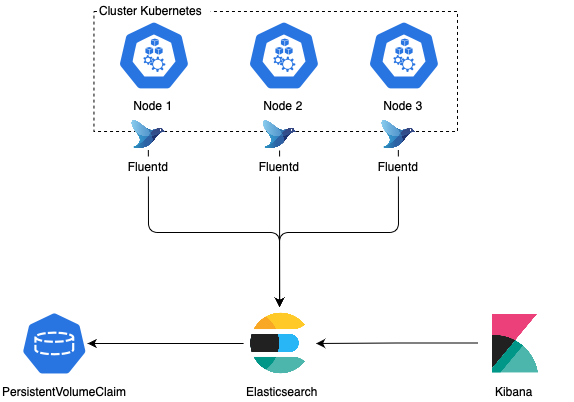

# Guia de instalação do EFK em cluster Kubernetes

### Introdução

Esse guia tem como objetivo documentar a instalação do EFK que é o acrônimo de ElasticSearch, FluentD e Kibana, num cluster Kubernetes.

Primeiramente vamos trazer uma breve explicação sobre cada uma das peças mencionadas anteriormente, mas não entraremos em detalhes, pois nosso foco é na instalação.

**Elasticsearch** é um mecanismo de busca baseado na biblioteca Apache Lucene. Ele fornece um mecanismo de pesquisa de texto completo distribuído com capacidade para vários locatários com uma interface da web HTTP e documentos JSON sem esquema.

**Fluentd** é um coletor de dados de código aberto, que permite unificar a coleta e o consumo de dados para um melhor uso e compreensão dos dados.

**Kibana** é um plugin de visualização de dados de fonte aberta para o Elasticsearch. Ele fornece recursos de visualização em cima do conteúdo indexado em um cluster Elasticsearch. Os usuários podem criar gráficos de barra, linha e dispersão, ou gráficos e mapas de torta em cima de grandes volumes de dados.

Utilizaremos o Fluentd como agente responsavel por coletar, filtrar, formatar e enviar os logs de todos os nós do nosso cluster Kubernetes para um cluster do Elasticsearch. Portanto, devemos implantar o Fluentd como DaemonSet, garantindo assim, com que o Pod do Fluentd rode em todos os nós do cluster. Já o cluster do Elasticsearch armazenará os dados recebidos num determinado volume, nos dando a possibilidade de realizar backups e restores dos seus dados. Por fim, vamos criar uma conexão entre o Kibana e o cluster Elasticsearch, para que sejamos capazes de visualizar os logs das aplicações de uma forma mais simplificada e organizada.

A figura abaixo ilustra a conexão entre as peças citadas acima.



### Instalação

Vamos fazer o uso de operadores para efetuar a instalação do Elastic Search e Kibana, com isso teremos CR "Custom Resources" para subir novos tipos de artefatos no Kubernetes, bem como ler os CRD "Custom Resources Definition" que seriam suas especificações/documentações. Utilizamos o operador desenvolvido pela equipe do ElasticSearch, portanto, ele é encarregado por implantar os artefatos da melhor forma possivel, até mesmo fazer um upgrade de versão.

> No momento em que escrevemos esta documentação não existe um operador para o FluentD.

Para facilitar a instalação de toda stack EFK disponibilizamos um script executável nomeado como ```install.sh```, sendo assim execute os simples comandos abaixo para instalar toda stack em seu cluster.

```shell
chmod +x install.sh
./install.sh
```

O executável acima executará todos os manifestos contidos neste diretório numa ordem específica pois existem dependência entre eles.

### Acessos 

Após a instalação ser concluida, execute o comando abaixo para obter a senha definida para o ElasticSearch.

```shell
kubectl get secret elasticsearch-es-elastic-user -o=jsonpath='{.data.elastic}' | base64 --decode; echo
```

Com a senha em mãos, faremos um port-forward para acessar o Kibana.

```shell
kubectl port-forward service/elasticsearch-kb-http 5601 -n elastic-system
```

Com o port-forward ativo, acesse o Kibana pelo endereço https://localhost:5601 em seu navegador. Ao acessar o Kibana você será redirecionado para a página de Login. O usuário para acesso é **elastic**, e a senha você obteve no passo anterior.

Foi disponibilizado um service do tipo load balancer para o Kibana, não necessariamente é preciso realizar o port-forward para acessar o Kibana. Utilizando o seguinte comando podemos obter o endereço externo vinculado ao nosso serviço.

```shell
kubectl get svc -n elastic-system
```

